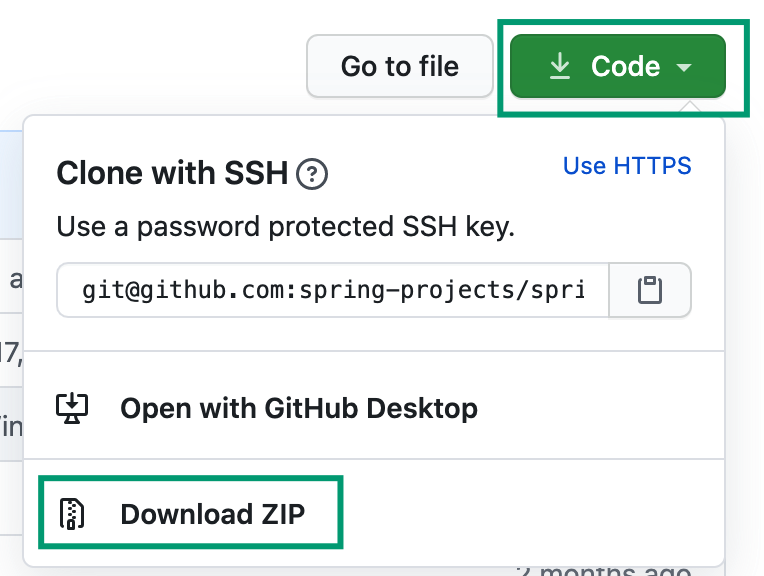

#  Spring Framework

> 此项目克隆至 Spring 官方 GitHub，版本号为 5.0.18.RELEASE，编译与运行主要用于学习 Spring 用途。

下面主要说明一下 Spring Framework 源码环境的搭建过程。

## 1. 下载与配置

**1.Spring Framework 下载**

我们可以到 [Spring Frame GitHub 官网](https://github.com/spring-projects/spring-framework)上下载源码，这里我选择的版本为 v5.0.18.RELEASE，可以通过 tag 选项进行选择，或者直接点击这里的网站：https://github.com/spring-projects/spring-framework/tree/v5.0.18.RELEASE

其次，我们这里直接选择下载 zip 压缩文档即可：



下载完成后解压，稍后使用 IDEA 打开。

**2.Gradle 安装**

这里 Gradle 的安装就不提了，我使用的 Gradle 版本为 Gradle 5.5.1。

可以通过如下命令来查询你本地的 Gradle 的版本：

```bash
gradle -v
```

然后确保你的 IDEA 使用的 Gradle 版本也是此版本，查询方式是：

Preferences ---> Build, Execution, Deployment ---> Gradle。

如下图所示：


事实上，你本地安装的 Gradle 版本并不重要，因为在导入 Spring Framework 以后，其会下载指定版本的 Gradle，这里 Spring Framework 项目所需的 Gradle 版本为 4.4.1，即使你与其版本保持相同（Gradle 的判定非常奇怪）。

以下是为 Gradle 添加代理的配置，但现在已经不必这么做了（除非你的依赖包的下载速度非常慢），因为 Gradle 在国内也有部署 CDN 了。

```
buildscript {
    repositories {
        maven{ url 'http://maven.aliyun.com/nexus/content/groups/public/'}
    }
}

allprojects {
    repositories {
        maven{ url 'http://maven.aliyun.com/nexus/content/groups/public/'}
    }
}
```

> 进行配置替换，而不是简单地复制整段内容，参考于：https://www.zhihu.com/question/37810416，如果没找到对应内容，才进行替换。

## 2. IDEA 导入项目

在 IDEA 上选择 Import Project，选择解压完成后的 Spring Framework 项目，然后选择 Gradle 目录。

### 2.1 异常与错误的解决

**1.第一个异常：exception during working with external system: java.lang.AssertionError**

解决办法参考于：https://blog.csdn.net/ldw598156412/article/details/103401616

解决办法主要是回退 IDEA 版本为 2019.2，**不要使用 2019.3**。下载网址为：https://www.jetbrains.com/idea/download/other.html

> 也不要轻易尝试其他版本的 IDEA，因为如果出现 BUG 会很麻烦。

**2.第二个错误：Error:(38, 38) java: package org.springframework.aop.target does not exist**

这是因为 GitHub 的管理导致的，其不将 target 目录下的文件与目录纳入版本管理。

这是由于 .gitignore 导致的问题，因为我们不想对 class 文件也进行版本管理，第一次 git push 代码到代码仓库时注意需要注释掉.gitignore 中的 target/，否则 spring-aop 和 spring-context_test 中的源文件也提交不上去。

不过在出现问题后，也能通过临时删除（提交后再次恢复）能够对此进行补救。

这样一来，.gitignore 文件中还是有 /target 配置属性。

别人也出现过这个问题，可见：https://github.com/bohenmian/spring

**3.第三个错误：Exception in thread "main" java.lang.NoClassDefFoundError: org/springframework/expression/PropertyAccessor**

如果出现类无法找到的错误，那么很有可能是由于 Gradle 编译过程中出错了，我们可以从 project 左侧栏上，选择对应的模块，这里的是 expression 模块，然后选择删除其 build 与 target 目录，然后利用 Gradle 执行 Tasks，other ---> compileTestJava。

### 2.2 编译 Spring 源码

**1.编译 spring-core 模块**

我们这里需要按照 Spring Framework 的各个模块来进行编译，我们点开 IDEA 右侧的 Gradle 插件，然后选择 spring-core ----> Tasks ----> Othrer ----> compileTestJava，如下图所示：


如果在控制台打出 `BUILD SUCCESSFUL in 123s` 就意味着模块编译成功，即使出现相关警告（红色字体提示），关系也不大。

**2.编译 spring-context 模块**

这一次我们不再依赖于 IDEA 的 gradle 插件，而是直接选择左侧项目栏 project 下的 spring-context 目录下的 test 路径，然后选择任意项目，比如 org.springframework，右击，选择 Run Tests... 按钮，如下图所示：


接着我们等待其跑完就行了。

> 出现乱码或者 WARNING 以及红色提示问题并不大。

**3.创建自己的应用程序模块**

右击 IDEA 左侧 project 栏，选择 new module，选择 gradle，java，名字随意，我在这里选择将其命名为 mybootstrap。

> 这里需要 IDEA 执行一定时间。

然后在自动跳出的、属于新 module 的 build.gradle 中的 dependencies 栏的第一栏追加如下内容：

```
compile(project(":spring-context"))
```

## 3. 使用 Spring Context 的项目测试与使用

为了避免每次通过 Gradle 来运行项目，因此我们这里需要一定的配置，File --->Setting ---> Build,Execution,Deployment ----> Build and run using IntelliJ IDEA 以及 Run test using IntelliJ IDEA，如下图所示：


然后在 biuld.gradle 中引入 spring-context 模块，加入如下的配置：

```
compile(project(":spring-context"))
```

在我们自己创建好的 Spring 项目 main/java 目录下创建 package，例如 cool.spongecaptain，然后依次创建三个类文件：

**1.配置类**

```java
@Configurable
@ComponentScan("cool.spongecaptain")
public class AppConfig {
}
```

**2.Bean 类**

```java
@Component("sponge")
public class MyBean {
    private String name;
    private int age;

    public String getName() {
        return name;
    }

    public void setName(String name) {
        this.name = name;
    }

    public int getAge() {
        return age;
    }

    public void setAge(int age) {
        this.age = age;
    }

    @Override
    public String toString() {
        return name + age;
    }
}
```

**3.测试类（这里指的是具有 Main 方法的类）**

```java
public class Test {
	public static void main(String[] args) {
		AnnotationConfigApplicationContext ac = new AnnotationConfigApplicationContext(AppConfig.class);
		MyBean sponge = (MyBean) ac.getBean("sponge");
		sponge.setAge(101);
		sponge.setName("captain");
		System.out.println(sponge);
	}
}
```

最后，如果我们通过上述类的静态方法完成启动，并在控制台上打印出 captain101，那便意味着我们已经成功编译的 Spring Context 模块。

**注意**：如果提示找不到相关符号（例如下图），那么我们可以选择重新删除相关模块的 biuld 目录，然后选择模块后，点击 IDEA 最上侧的 Build 栏，选择编译整个模块。


但是更好的方式是在自己的 module 中的 build.gradle 文件的 dependencies 下添加如下内容：

```
compile(project(":spring-instrument"))
```

然后，Gradle 插件会自动工作，此时我们选择再次运行 Test 的 Main 方法就能避免出现未找到符号错误。

---

然而，我们在这里仅仅是完成了 Spring Context 模块的引入，但是如果希望进行 Web 开发，那么将引入更多的问题，不过至少，我们现在可以基于 Spring Core 进行源码的分析了。